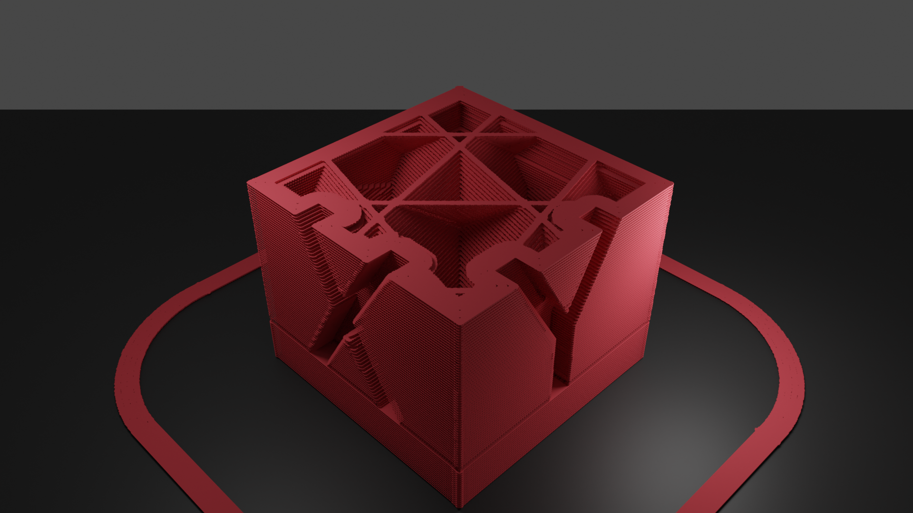

# FDM 3d-printer simulator

`tdp-tl` is a 3D printer simulator which targets to simulate visual artifacts of FDM printing: layer lines, under/over extrusion marks, ringing/ghosting, infills, supports.

## Getting Started

```sh
cargo build --release

# generate obj models, from gcode layer by layer
tdp-tl gcode-layers --gcode KK_xyzCalibration_cube.gcode --out gcode/

# render obj model to still image, with blender
find gcode/ -maxdepth 1 -type f -name '*.obj' \
    | xargs -n1 -P4 -I{} blender -b tdp.blend --background --python render.py -- {} "{}.png"

# convert still images to timelapse video
ffmpeg -framerate 24 -pattern_type glob -i 'gcode/*.png' -c:v libx264 -pix_fmt yuv420p timelapse.mp4
```

## Demo


[demo video](https://www.youtube.com/watch?v=bPexqm6nO7Q)


## Limitations / TODO

model-generation
 - Following parameters are hard-coded
   - layer height (0.2mm)
   - filament diamger (1.75mm)
   - voxel size (0.04mm)
 - Tested with [Ultimaker Cura](https://ultimaker.com/software/ultimaker-cura) slicer only.
 - `.obj` model file could be very large, several gigabytes for 20mm calibration cube.

rendering
 - bundled [blender](https://www.blender.org) scene is optimized for 20mm calibration cube.
 - requires large amount of memory for rendering.
